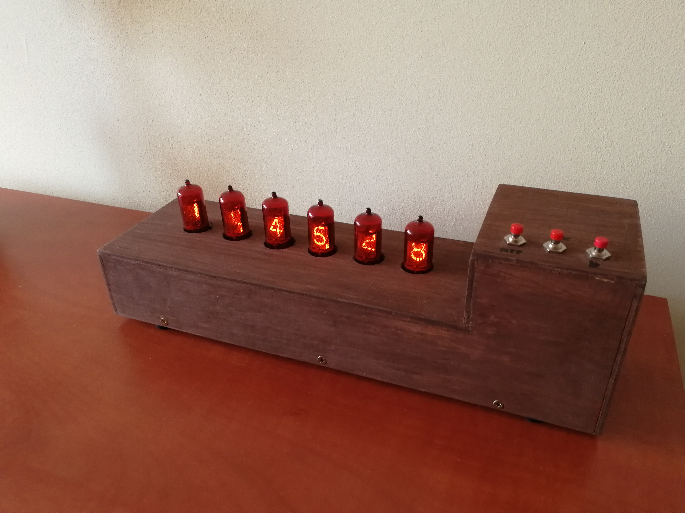
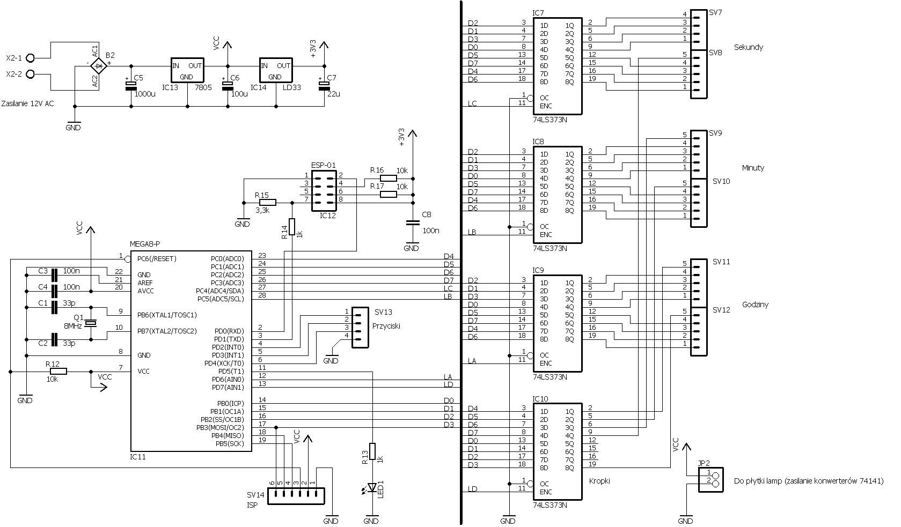
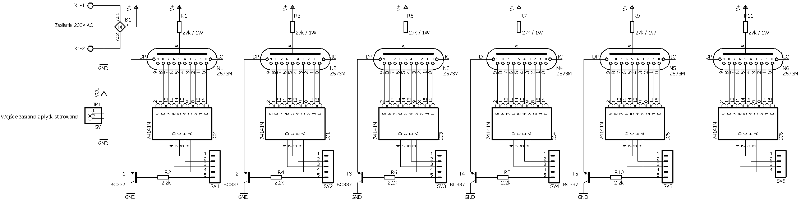
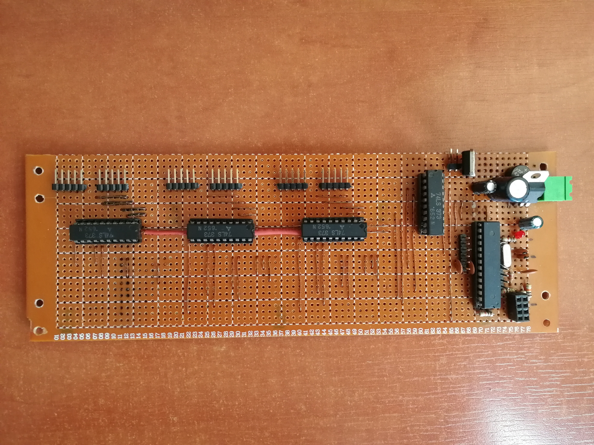
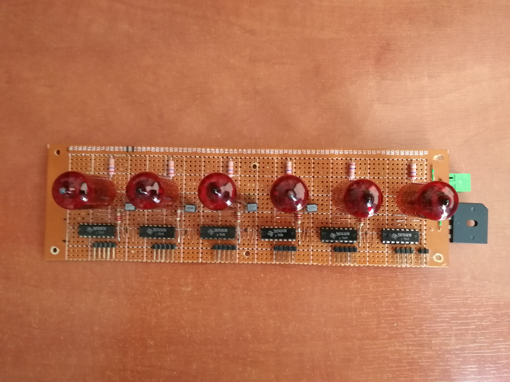
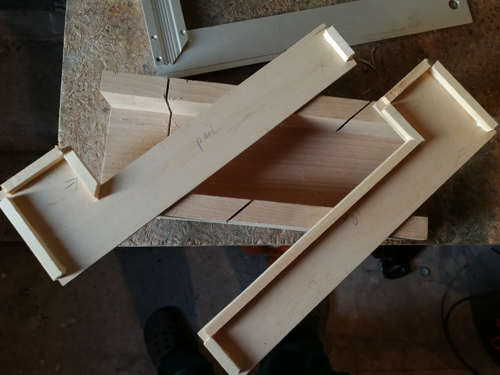
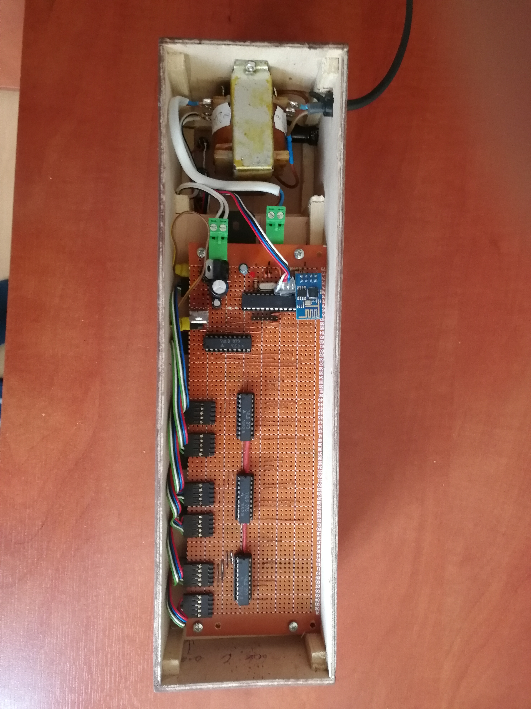

# diy_iot_nixie_clock_ntp
NTP synchronized nixie clock

This is a dump of my 6-digit nixie clock project from 2017, which
* Shows time in HH:MM:SS
* Shows date in MM-DD
* Synchronizes with NTP server via Wi-Fi.

Link to original description (in polish): https://majsterkowo.pl/zegar-nixie-synchronizowany-z-ntp-cz-1/

## Hardware
There are 2 MCUs inside. ATMega8 controls nixie valves and switches. ESP8266 provides connection to Wi-Fi and provides syncing via NTP server (optional).
To drive nixie valves, there are 6x 74LS377 open-collector amplifiers and 3x 74LS377 latches inside. 

I used Z573M valves, removed from obsolete measuring equimpement. Anode voltage (~120 volts) is generated from 12V voltage by simple step-up converter.

## Software

The clock is based on ATMega8 MCU. Source code is written in "plain" C in WinAVR IDE, but it is compillable using avr-gcc. 

ESP8266 (ESP-01 module) provides Wi-Fi connection:
* Gets data (time in UTC) from NTP server,
* Converts to localtime (CET/CEST), including switches from/to DST,
* Parses time and sends it to ATMega8 via UART.

The code has been written in C++ in Arduino IDE using open-source libraries.

## Schematic

 

## Photos

There are 2 PCBs inside, connected together by a few BLS connectors:

  

I used prototype PCBs so I spent a lot of time to patch everything using copper wire:

I also made a wooden enclosure: 

 

And here final assembly. I replaced transformer for DC step-up converter later to supply from 12V power brick and reduce heating.

# TODO
* Provide DCF77 time sync (Hardaware and software)
* Make some remote setup option for ESP module (to configure SSID/password, for now it must be hard-coded before building and flashing).

